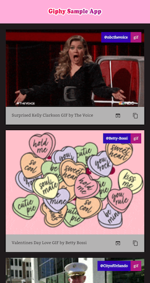
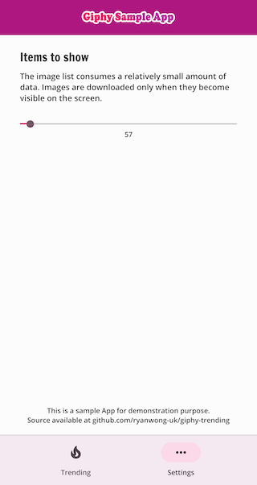
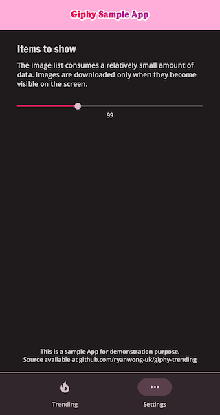

# giphy-trending - Sample Android App for skills demonstration [](https://app.travis-ci.com/ryanwong-uk/giphy-trending) [](https://codecov.io/gh/ryanwong-uk/giphy-trending)

This is a sample app originally based on
the [walk through](https://medium.com/codex/android-tutorial-part-1-using-room-with-rxjava-2-dagger-2-kotlin-and-mvvm-f8a54f77d3fa)
by Fahri Can. As I work on the project, the App now has most of its code rewritten on my own.

 
 

## Skills covered:

The Android Development world is currently experiencing a shift of technology stack. Besides
migrating from Java to Kotlin, we have a choice of Coroutines over RxJava, Hilt over Dagger, and
JetPack Compose over the traditional XML/RecyclerView layouts.

This Sample App is for demonstrating the traditional approach which applies XML UI, RxJava, and
Dagger. `Coroutines` / `suspend functions`, Kotlin `flow` are used for `PreferencesDataStore`
because `RxJava` really has no advantages here. Personally I would recommend `Coroutines`
over `RxJava`, as it is much easier for coding common REST API Apps -- If we can have something done
in a simple way, why make it complex?

### High level architecture

* Kotlin
* MVVM architecture
* ['Jetpack Databinding'](https://developer.android.com/jetpack/androidx/releases/databinding)
* Live Data
* Material 3 with light and dark mode theming
* CI: [Travis-CI](https://travis-ci.org/)
* Code coverage: [codecov](https://codecov.io/)

### Major libraries used

* [`Jetpack ConstraintLayout`](https://developer.android.com/jetpack/androidx/releases/constraintlayout)
* [`Jetpack Navigation`](https://developer.android.com/jetpack/androidx/releases/navigation)
* [`Jetpack Lifecycle`](https://developer.android.com/jetpack/androidx/releases/lifecycle)
* User preferences: [`Jetpack PreferencesDataStore`](https://developer.android.com/jetpack/androidx/releases/datastore) with Kotlin [`Coroutines`](https://github.com/Kotlin/kotlinx.coroutines) and `Flow`
* Database: [`Jetpack Room`](https://developer.android.com/jetpack/androidx/releases/room)
* [`Retrofit2`](https://square.github.io/retrofit/)
* [`Moshi`](https://github.com/square/moshi)
* [`RxJava 2`](https://github.com/ReactiveX/RxJava)
* Splash Screen API
* Network images: [`Glide`](https://github.com/bumptech/glide)
* DI: [`Dagger2`](https://github.com/google/dagger)
* Logging: [`Timber`](https://github.com/JakeWharton/timber)
* Memory leak detection: [`LeakCanary`](https://github.com/square/leakcanary)
* Tests: [`JUnit 4`](https://github.com/junit-team/junit4) and [`Hamcrest`](http://hamcrest.org/JavaHamcrest/)

## Improvements:

The original sample codes were over simplified. Modifications have been made to make the App look
more production-ready.

* The UI architecture and list item layout have been redesigned to apply Material 3 specifications
* The database schema and DAOs have been improved to support more functionalities
* The RecyclerView has been modified to use ListAdapter, DiffUtils to avoid expensive
  notifyDataSetChanged()
* Additional handling done to preserve the scrolling state and avoid flickering during refresh
* Menu button has been added to allow manual refresh
* A dedicated Domain Model was added to separate the Network Data Model
* Introduced copy image link, and open Giphy page on browser functions
* Added user customisable API limit
* Added test cases

## Requirements

* Android Studio Arctic Fox 2021.3.1 Patch 2
* Android device or simulator running Android 5.0+ (API 21)

## Setting up the keystore

* Android keystore is not being stored in this repository. You need your own keystore to generate
  the apk / App Bundle

* You also need to have your own [Giphy API Key](https://developers.giphy.com/)

* To ensure sensitive data are not being pushed to Git by accident, the keystore and its passwords
  are kept one level up of the project folder, so they are not managed by Git.

* If your project folder is at `/app/giphy-trending/`, the keystore file and `keystore.properties`
  should be placed at `/app/`

* The format of `keystore.properties` is:
  ```
     store=/app/release-key.keystore
     alias=<alias>
     pass=<alias password>
     storePass=<keystore password>
     giphyApiKey="<your API Key here>"
  ```

## Building the App

### Build and install on the connected device

   ```
   ./gradlew installDebug
   // or
   // ./gradlew installRelease
   ```

* Options are: `Debug`, `Release`
* Debug builds will have an App package name suffix `.debug`

### Build and sign a bundle for distribution

After August 2021, all new apps and games will be required to publish with the Android App Bundle
format.

   ```
   ./gradlew clean && ./gradlew bundleRelease
   ```

### Build and sign an apk for distribution

   ```
   ./gradlew clean && ./gradlew assembleRelease
   ```

* The generated apk(s) will be stored under `app/build/outputs/apk/`
* Other usages can be listed using `./gradelew tasks`

## To-do lists:

This sample App is for demonstrating my coding habit and skills for potential employers. Here is a
list of things I may further work on, while waiting for my next Android Developer role:

* More test cases
* Better DI approach (pending peer code review)
