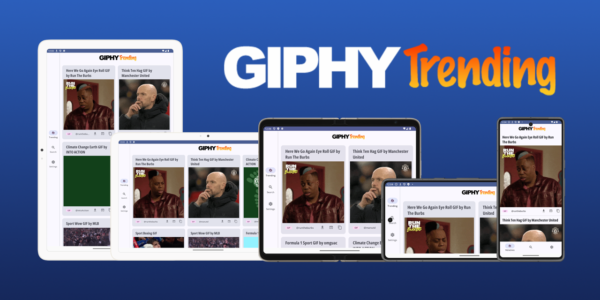

# Giphy Trending  [](https://codecov.io/gh/ryanw-mobile/giphy-trending)

This sample Android app presents the Giphy trending animated gifs for sharing or download. You can
now also search animated gifs by keyword.

&nbsp;

It was elaborated from the work
by [Fahri Can](https://medium.com/codex/android-tutorial-part-1-using-room-with-rxjava-2-dagger-2-kotlin-and-mvvm-f8a54f77d3fa)
in Nov 2021. I migrated the codebase from RxJava to Coroutines, and then from XML Views to Jetpack
Compose. The current release is completely different from the original version after these years.

&nbsp;

<p align="center">
  <br/>
  
</p>

&nbsp;

### The original XML View version

The XML View version is no longer being maintained. You can check out
the [XML View version branch](https://github.com/ryanw-mobile/giphy-trending/tree/XmlView) for that.
It was using XML with Data-binding, which we
generally believe it to be a bad coding practice by tightly coupling the business logic with the UI.

&nbsp;

### High level architecture

* Kotlin
* MVVM & clean architecture
* Jetpack Compose - Single Activity
* Kotlin Coroutines and Flow
* Dependency Injection using Dagger Hilt
* Material 3 dynamic colour theming supporting light and dark modes
* Dynamic screen layout support using Windows Size Class
* Gradle Kotlin DSL and Version Catalog
* Macrobenchmark and Baseline Profile
* Full unit test and UI (Journey) test suite

&nbsp;

### Major libraries used

* [Jetpack Compose](https://developer.android.com/jetpack/androidx/releases/compose) - Modern
  toolkit for building native UI
* [Jetpack Navigation for Compose](https://developer.android.com/jetpack/androidx/releases/navigation#navigation-compose) -
  Navigation library for Jetpack Compose applications
* [Jetpack Lifecycle](https://developer.android.com/jetpack/androidx/releases/lifecycle) -
  Lifecycle-aware components, including ViewModel support for Jetpack Compose
* [Jetpack PreferencesDataStore](https://developer.android.com/jetpack/androidx/releases/datastore) -
  Data storage solution
* [Kotlin Coroutines](https://github.com/Kotlin/kotlinx.coroutines) - Asynchronous programming
  with coroutines
* [Kotlin Flow](https://kotlinlang.org/docs/flow.html) - Reactive streams for Kotlin
* [Jetpack Room](https://developer.android.com/jetpack/androidx/releases/room) - Database library
  for local data storage
* [Retrofit2](https://square.github.io/retrofit/) - HTTP client for Android and Java
* [Moshi](https://github.com/square/moshi) - Modern JSON library for Android and Java
* [Splash Screen API](https://developer.android.com/guide/topics/ui/splash-screen) - Official
  splash screen solution
* [Coil](https://coil-kt.github.io/coil/) - Image loading library for Android, leveraging Kotlin
  Coroutines
* [Dagger Hilt](https://dagger.dev/hilt/) - Dependency injection framework
* [Timber](https://github.com/JakeWharton/timber) - Logging utility
* [LeakCanary](https://github.com/square/leakcanary) - Memory leak detection tool
* `JUnit 4` - Testing framework and runner
* [Robolectric](https://robolectric.org/) - Testing framework for Android-JVM tests
* [kotest](https://kotest.io/) - We use the assertion library only, not the runner
* [MockK](https://mockk.io/) - Mocking library for Kotlin
* [Ktlint Gradle](https://github.com/jlleitschuh/ktlint-gradle) - Plugin for linting and formatting
  Kotlin code
* [Kover](https://github.com/Kotlin/kotlinx-kover) - Kotlin code coverage tool
* [Github Action](https://github.com/features/actions) - CI/CD
* [codecov](https://codecov.io/) - code coverage

&nbsp;

## Contribution invitation

For this being a demo app, you are more than welcomed to join either helping to clear some of the
pending tasks, or improve the app. Contact me if you are interested.

&nbsp;

## To-do lists

Planned enhancements are
now [logged as issues](https://github.com/ryanw-mobile/giphy-trending/issues?q=is%3Aopen+is%3Aissue+label%3Arefactor%2Cfeature%2Cfix%2Ctest).

&nbsp;

## Requirements

* Android Studio Iguana | 2023.2.1
* Android device or simulator running Android 9+ (API 28)

&nbsp;

## Binaries download

If you want to try out the app without building it, check out
the [Releases section](https://github.com/ryanw-mobile/giphy-trending/releases) where you can find
the APK and App Bundles for each major version. A working Giphy API key was applied when building
the app, therefore you can test it by just installing it.

&nbsp;

## Building the App

* To build the app by yourself, you need your own [Giphy API Key](https://developers.giphy.com/)

### Setting up the keystore

Release builds will be signed if either the keystore file or environment variables are set.
Otherwise, the app will be built unsigned and without the Giphy API key installed, which will not
pull any data from the endpoint.

### Local

* Android Keystore is not being stored in this repository. You need your own Keystore to generate
  the apk / App Bundle

* If your project folder is at `/app/giphy-trending/`, the Keystore file and `keystore.properties`
  should be placed at `/app/`

* The format of `keystore.properties` is:
  ```
     store=/app/release-key.keystore
     alias=<alias>
     pass=<alias password>
     storePass=<keystore password>
     giphyApiKey="<your API Key here>"
  ```

### CI environment

* This project has been configured to support automated CI builds.

* The following environment variables have been set to provide the keystore:
  ```
     BITRISE = true
     HOME = <the home directory of the bitrise environment>
     BITRISEIO_ANDROID_KEYSTORE_PASSWORD = <your keystore password>
     BITRISEIO_ANDROID_KEYSTORE_ALIAS = <your keystore alias>
     BITRISEIO_ANDROID_KEYSTORE_PRIVATE_KEY_PASSWORD = <your keystore private key password>
     GIPHYAPIKEY= <your API Key>
  ```

### Build and install on the connected device

This app has two build variants: `Debug` and `Release`. The most common build commands are:

* `./gradlew clean installDebug`
* `./gradlew clean instal`
* `./gradlew clean bundleRelease`
* `./gradlew clean assembleRelease`

The generated apk(s) will be stored under `app/build/outputs/`

&nbsp;

### License

#### Attribution-NonCommercial (CC BY-NC 4.0)

Nothing is free in this world. RW MobiMedia UK Limited, a fully tax-paying entity in the UK,
sponsors the infrastructure and development costs of this project. 

Copyright 2024 RW MobiMedia UK Limited

This project is licensed under the Creative Commons Attribution-NonCommercial 4.0 International License. To view a copy of this license, visit [http://creativecommons.org/licenses/by-nc/4.0/](http://creativecommons.org/licenses/by-nc/4.0/) or send a letter to Creative Commons, PO Box 1866, Mountain View, CA 94042, USA.

#### Conditions
Under the terms of this license, you are free to:
- **Share** — copy and redistribute the material in any medium or format.
- **Adapt** — remix, transform, and build upon the material.

The licensing terms include the following stipulations:
- **Attribution** — You must give appropriate credit, provide a link to the license, and indicate if changes were made. You may do so in any reasonable manner, but not in any way that suggests the licensor endorses you or your use.
- **NonCommercial** — You may not use the material for commercial purposes. Any commercial use is strictly prohibited without prior permission from RW MobiMedia UK Limited.

#### Disclaimer
This work is provided "as is" without any warranties, and the licensing coverage is only applicable as long as the distribution or use is for non-commercial purposes.

#### Further Enquiries
For permissions beyond the scope of this license, please contact RW MobiMedia UK Limited.
